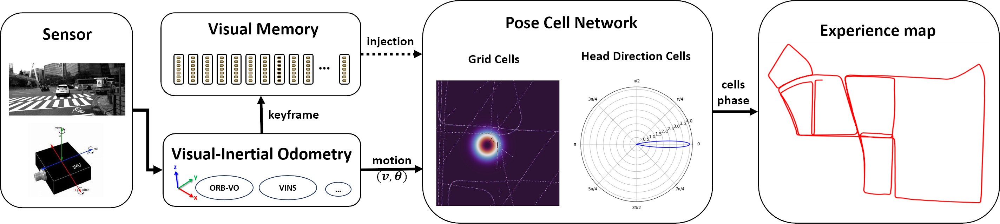
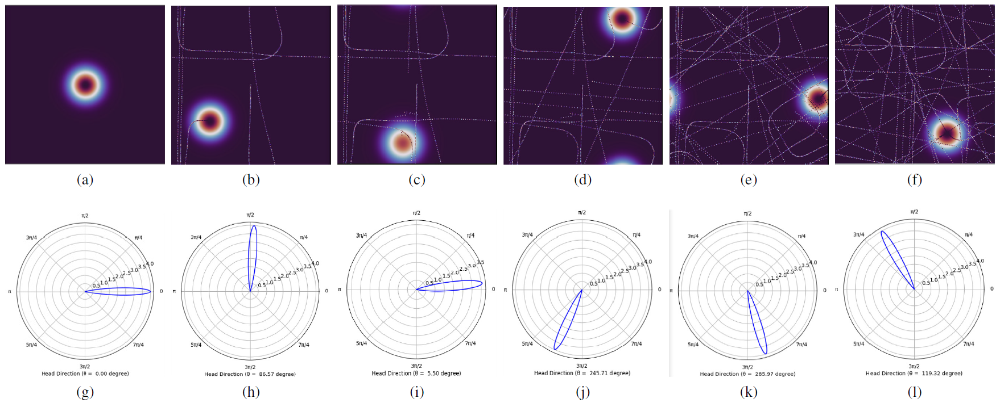
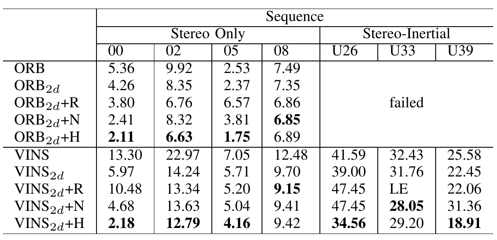
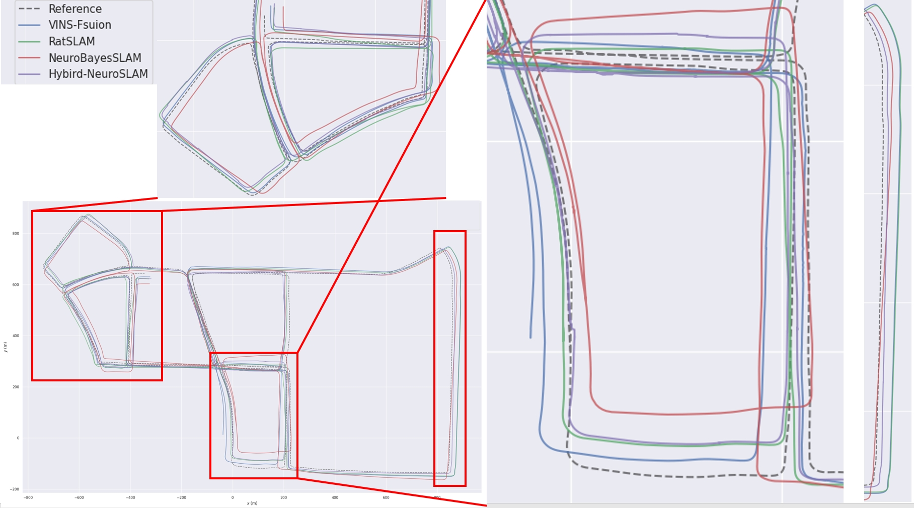
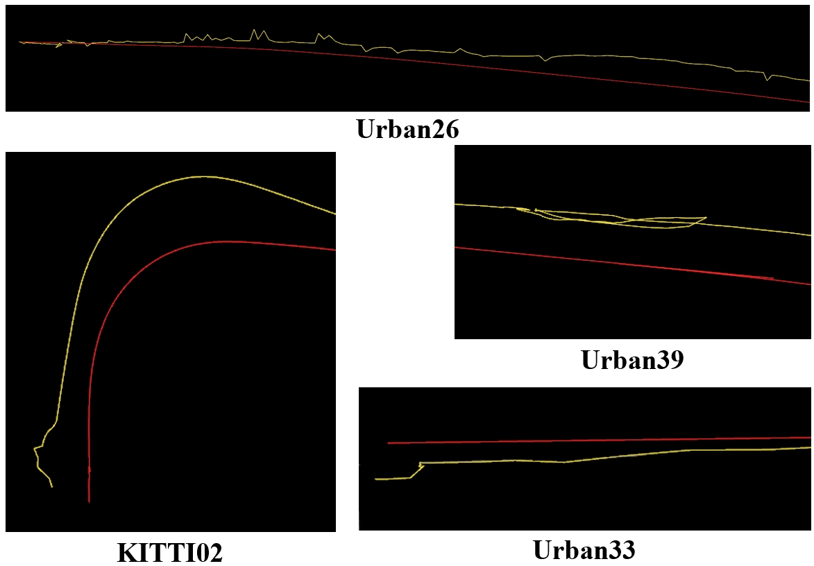

# Hybrid-NeuroSLAM: A neurobiologically inspired hybrid Visual-Inertial SLAM method for Large Scale Environment
Tengfei Lu, Zhongli Wang, Xiaoyang Fan, Yan Shen, Xiaotao Shao

#### Videos
> [Urban39]( https://www.bilibili.com/video/BV1NJyxYwEx4/?vd_source=0e1f9dcbcbc75fb21e42454eac0c8a37)
[Urban33](https://www.bilibili.com/video/BV1c4yxY4Ekj/?vd_source=0e1f9dcbcbc75fb21e42454eac0c8a37)
[Urban26](https://www.bilibili.com/video/BV1ctyxYdEAX/?vd_source=0e1f9dcbcbc75fb21e42454eac0c8a37)
[KITTI00](https://www.bilibili.com/video/BV1wsyxYZEhL/?vd_source=0e1f9dcbcbc75fb21e42454eac0c8a37)
[KITTI02](https://www.bilibili.com/video/BV1HsyxYZEQR/?vd_source=0e1f9dcbcbc75fb21e42454eac0c8a37)
[KITTI05](https://www.bilibili.com/video/BV1AWyxYbEgu/?vd_source=0e1f9dcbcbc75fb21e42454eac0c8a37)
[KITTI08](https://www.bilibili.com/video/BV1AWyxYbETM/?vd_source=0e1f9dcbcbc75fb21e42454eac0c8a37)

<!-- #### [Project Page](https://16lemoing.github.io/dot) | [Paper](https://arxiv.org/abs/2312.00786) | [Video](https://www.youtube.com/watch?v=H0Rvq0OL87Y) | [BibTeX](#citation) -->

<!-- 

 -->

Animals in nature exhibit remarkable spatial cognition abilities, enabling them to achieve long-distance autonomous navigation efficiently in unknown environments. Neurobiologically inspired SLAM methods primarily aim to mimic this capability of spatial cognition and navigation. However, existing works have only been able to perform rough velocity estimation with scanline intensity profiles, which may lead to a severely distorted cognitive map, particularly in large scale environment. This work presents a novel neurobiologically inspired Visual-Inertial SLAM method, called Hybrid-NueroSLAM, that addresses two issues: precisely visual-inertial fusion-based motion estimate and map consistency for large size environment. 
Based on high-precision Visual-Inertial odometry, a precise and robust visual memory mechanism, and a neural cell network based on our proposed Improved Bayesian Attractor for spatial cognition, it constructs a semi-metric topological experience map.

## Pipeline

<!-- > **We will release the source code of this work after the paper is accepted！**  -->
> **The source code is coming soon！** 

## Experiment Results

<!-- > **Running on:** AMD R7 5800H with 16G RAM DDR4 3200MHz -->

- **Chronological ordered snapshots of active grid cells and HD cells during the processing of sequence 39 of the Complex Urban dataset.**
    >(a-f) depict the state of grid cell network in the progression. The color depth of the active grid cell center indicates the strength of uncertainty in self-position estimation (lighter colors represent greater uncertainty). The second row(g-l)  corresponds to the state of the HD Cell at the same moment as in the first row. The area of the active HD cell represents the strength of uncertainty in self-head direction estimation (larger areas indicate greater uncertainty)

    

- **Comaprison of accuracy in KITTI & URBAN dataset with ATE RMSE(M) (with SE(3) Umeyama alignment).**
    >"ORB" and "VINS" represent the Visual odometry part of ORB-SLAM and VINS-fusion respectively. "$_{2d}$" represents the trajectory after removing the vertical direction, "R, N, H" represent RatSLAM, NeuroBayesSLAM and our Hybird-NeuroSLAM respectively and "Ux" represents the x sequence of urban. Best results are in bold, "LE" represents loop error occured.

    

- **Comparation of trajectories on Urban39.**
    >Vins-fusion serves as the odometry node for the other three neurobiologically inspired SLAM methods.

    

- **Trajectory jitters optimization.**
    > The yellow line is trajectory form odometry node and the red line is trajectory optimzed by our neurobiologically inspired method.

    